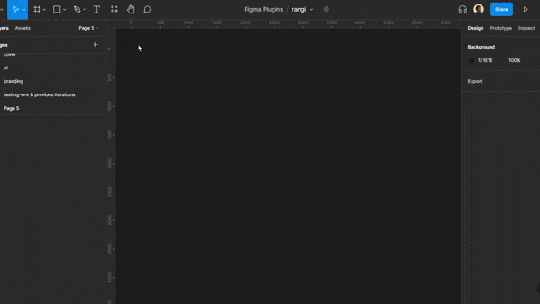

# rangi

A Figma plugin to help generate hues, tints, and/or shades

## Features

- [x] Generate hues from a given color.

- [x] Generate tints from a given color

- [x] Generate shades from a given color

## How it works

### Generating Hues

rangi takes a color input and an interval value. It converts the color to HSL(Hue, Saturation, Light) value and plus or minus the interval value from the H value until it's either greater or equal to 0 or less or equal to 359. The max is set to 359 because some color values would give a black color when they hit 360.

### Generating Tints

To generate Tints, rangi takes the initial color, converts it to HSL(Hue, Saturation, Light) value adds the interval value to the L value until the L value is less or equal to 100.

### Generating Shades

Shades generation is similar to tints generation except instead of adding the interval value to the L value, rangi substracts it until the L value is less or equal to 0.

## Todo & Roadmap

If the plugin gains traction, the plan is to do the following:

- [ ] Refactor code
- [ ] Add ability for users to configure the generated frames, things like size, frame orientation, shape, naming, etc.

## Assets & Links

UI design of the plugin:
https://www.figma.com/community/file/1157058671138458897

Plugin in Figma community:
https://www.figma.com/community/plugin/1153959136228678599

Built and maintained with ❤ by [Flexcode Labs](https://flexocelabs.com)
